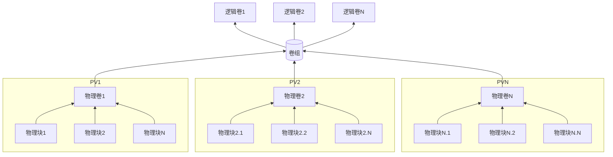

LVM 是物理硬盘与文件系统之间添加的一个抽象层，用以屏蔽下层的硬盘布局，使得文件系统突破单个硬盘的限制。文件系统不在是对单个物理硬盘直接操作，而是通过逻辑卷，使得文件系统可以跨越多个物理硬盘。
使用 lvm 时有些基本术语需要知道：
pv 物理卷 （physical volume）：lvm 的基本存储块设备，一个分区或整个磁盘都可以
vg 卷组 （volume group）：一个或多个 pv 组成的存储池
lv 逻辑卷 （logical volume）：从 vg 中分配的存储空间，用以给文件系统使用
pe 物理块 （physical extent）：物理卷（pv）中可分配的最小存储单元，pe 的默认值为 4MB
le 逻辑块 （logical extent）：逻辑卷中用于分配的最小存储单元，逻辑块的大小取决于逻辑卷所在卷组中的物理块大小。
架构可以参考如下图



lvm卷的创建可以使用整个硬盘也可以使用分区，使用整个硬盘直接使用 pvcreate 命令即可，使用分区需使用 parted 先分好区。推荐使用分区，因为直接使用整个硬盘，一些磁盘工具会识别不了，当其他人维护时可能出错。比如：使用整盘以及分区时 fdisk 的显示如下
```
[root@localhost ~]# fdisk -l /dev/sdb
Disk /dev/sdb: 10 GiB, 10737418240 bytes, 20971520 sectors
Units: sectors of 1 * 512 = 512 bytes
Sector size (logical/physical): 512 bytes / 4096 bytes
I/O size (minimum/optimal): 4096 bytes / 4096 bytes

\\使用分区时
[root@localhost ~]# fdisk -l /dev/sdd
Disk /dev/sdd: 10 GiB, 10737418240 bytes, 20971520 sectors
Units: sectors of 1 * 512 = 512 bytes
Sector size (logical/physical): 512 bytes / 4096 bytes
I/O size (minimum/optimal): 4096 bytes / 4096 bytes
Disklabel type: gpt
Disk identifier: 276769D6-D89F-4015-B3EC-BD3D2F3DE059

Device     Start      End  Sectors Size Type
/dev/sdd1   2048 20969471 20967424  10G Linux LVM
```
使用分区时可以清晰的看出磁盘类型为 lvm 的。以及在一些 lvm + raid 的使用中，当更换 raid 中某块损坏的硬盘时，新盘必须大于或等于损坏的硬盘，否则无法完成重建的过程。但即使同一厂商相同型号的硬盘有时容量上也会有细微差别。通过在磁盘末尾保留一部分空间，可以消除磁盘容量上的细微差异。
使用 parted 格式化磁盘如下
```
[root@localhost ~]# parted /dev/sdc    \\对sdc进行格式化
GNU Parted 3.2
Using /dev/sdc
Welcome to GNU Parted! Type 'help' to view a list of commands.
(parted) mklabel gpt               \\给磁盘打上gpt的标签，用于超过2t的磁盘
(parted) mkpart primary 0% 100%    \\创建占用整个磁盘的分区，使用百分比会做磁盘对齐
(parted) set 1 lvm on              \\给1号分区设置 lvm 标志
(parted) print                     \\查看分区表
Model: Msft Virtual Disk (scsi)
Disk /dev/sdc: 10.7GB
Sector size (logical/physical): 512B/4096B
Partition Table: gpt
Disk Flags:

Number  Start   End     Size    File system  Name     Flags
 1      1049kB  10.7GB  10.7GB               primary  lvm

(parted) quit                     \\退出
```
一个示例：
创建一个3磁盘的 vg，并创建一个占用所有空闲空间的 lv，并使用 xfs 格式化分区
```
pvcreate /dev/sd{b1,c1,d1}
vgcreate vg_db /dev/sd{b1,c1,d1}
lvcreate -l 100%free -n lv_db vg_db
mkfs.xfs /dev/vg_db/lv_db
```
关于 vg 的一些操作
创建名为vg_db 的 vg
```
vgcreate vg_db /dev/sd{b1,c1,d1}
```
创建 pe 为 16M 的 vg （默认为4M）
```
vgcreate -s 16M vg_test /dev/sde1
```
扩容 vg 空间
```
vgextend vg_db /dev/sde1
```
删除 vg
```
vgremove vg_db   \\当有逻辑卷时，会要求确认
```
查看 vg 由哪些 pv 组成
```
pvscan
```
将一个 pv 移除 vg
```
pvs -o+pv_used    \\查看 pv 使用情况，为移除做准备（如若有足够的物理空间）
pvmove /dev/sde1  \\将 /dev/sde1 中的数据移动到其他 pv 中
vgreduce vg_db /dev/sde1  \\将 sde1 移除 vg
```
关于 lv 的一些操作
创建指定大小的 lv，并命名为 lv_db
```
lvcreate -L 200G -n lv_db vg_db
```
创建一个有100个 le 的 lv
```
lvcreate -l 100 vg_db
```
创建使用所有剩余空间的 lv
```
lvcreate -l 100%free -n lv_db vg_db
```
扩容 lv 空间
```
lvextend -L +20G /dev/vg_db/lv_db
```
使用所有剩余空间
```
lvextend -l 100%FREE /dev/vg_db/lv_db
```
重定义 lv 空间，缩小 10G
```
lvresize -L -10G /dev/vg_db/lv_db
```
删除 lv
```
lvremove vg_db lv_db
```
条带卷（大量读写时，可提高效率，raid0 模式）使用 -i 指定条带数，-I(大写 i) 指定条带大小以 kB 为单位。条带数不能超过该卷组的物理卷数（除非使用 --alloc anywhere 参数）
创建一个3条带，每条带 64 KB，大小为10G，名为 striped_lv_db 的卷
```
lvcreate -i 3 -I 64 -L 10G -n striped_lv_db vg_db
```
创建一个镜像卷，使用 -m 指定副本数。于raid1不同的是镜像卷有日志，可用于集群
```
lvcreate --type mirror -L 10G -m 1 -n mirror_lv_db vg_db
```
创建一个 raid5 卷，10G大小，3条带（最少需要4个 pv，3 条带+1 隐式奇偶校验驱动器）
```
lvcreate --type raid5 -L 10G -i 3 -n raid5_lv_db vg_db
```
lvm缓存
lvm 可以使用快速设备来做为缓存，以提高访问速度。lvm 支持的缓存类型有：
dm-cache：此类型会缓存读写操作
dm-writecache：此类型只缓存写操作
当为逻辑卷启用缓存时，逻辑卷的组成取决与缓存方法以及是否使用 cachevol 或者 cachepool 选项
cachevol：会同时保存数据块的缓存副本及元数据于快速设备上
cachepool：将缓存的数据与元数据可使用独立的设备分别保存
dm-writecache 方法与 cachepool 不兼容
示例：
创建 cachevol 卷，并将缓存卷附加到逻辑卷上
```
lvcreate -L 30G -n cachevol_lv_db vg_db /dev/sde1
lvconvert --type cache --cachevol cachevol_lv_db vg_db/lv_db
```
创建 cachepool 卷
```
lvcreate --type cache-pool -L 20G -n cachepool_lv_db vg_db /dev/sde1
lvconvert --type cache --cachepool cachepool_lv_db vg_db/lv_db
```
创建 cachepool 卷时可以使用 poolmetadata 来指定元数据的位置，例如：
```
lvcreate -L 2G -n lv_cache_meta vg_db /dev/sdd1
lvcreate -L 100G -n lv_cache_data vg_db /dev/sde1
lvconvert --type cache-pool --poolmetadata vg_db/lv_cache_meta vg_db/lv_cache_data
lvconvert --type cache --cachepool vg_db/lv_cache_data vg_db/lv_db
```


**参考文章**
[**配置与管理逻辑卷**](https://access.redhat.com/documentation/zh-cn/red_hat_enterprise_linux/8/html/configuring_and_managing_logical_volumes/logical_volumes-configuring-and-managing-logical-volumes#lvm_definition-overview-of-lvm)
**​**

