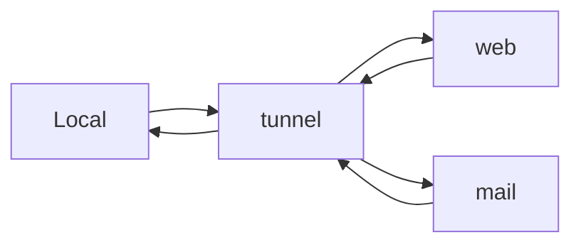

SSH端口转发的作用

1. 对未加密的数据，加密传输
1. 作为跳板机，绕过防火墙

SSH端口转发的分类：本地转发，远程转发，动态转发。分别如下。

1. **本地转发**

本地转发指的是，将 SSH 服务当做一个跳板机（tunnel-host)，把本地指定端口的流量
都通过跳板机发送到特定的目标上


```
ssh -Nf -L [bind_address:]local-port:target-host:target-port tunnel-host
//将本地的 9527 端口与目标 80 端口建立隧道
ssh -Nf -L 9527:www.example.com:80 usename@tunnel-host
```
上面命令中：
-N：不执行远程命令，和 -f 配合使用
-f ：在后台执行，不用登录到远程主机
-L：本地转发
bind_address：只有一个 ip 地址时可以不写

2. **远程转发**

远程转发与本地转发相反。建立本地到目标计算机的 SSH 隧道后，本地转发是通过本地计算机
访问远程计算机，而远程转发则是通过远程计算机访问本地计算机。
当外部主机想要访问防火墙内部主机时，先使用内部主机与外部主机建立隧道，然后通过访问远程主机的指定端口来访问内部资源


```
ssh -Nf -R remote-port:local-host:local-port remotehost
//将本地 80 端口，映射给远程主机的 9527 端口
ssh -Nf -R 9527:localhost:80 username@remotehost
```
注意：如果远程主机，是公网的地址，需要设置 GatewayPorts yes 否则不会对公网进行转发

3. **动态转发**

前面介绍的端口转发方式都是两个特定端口间的转发，如果想用同一个本地端口访问不同的
外部服务，就要使用动态转发，将 ssh 作为 SOCKS 代理服务器，通过读取发起应用的请求，来
获取目标信息


```
ssh -Nf -D [bind-address:]local-port tunnel-host
```
